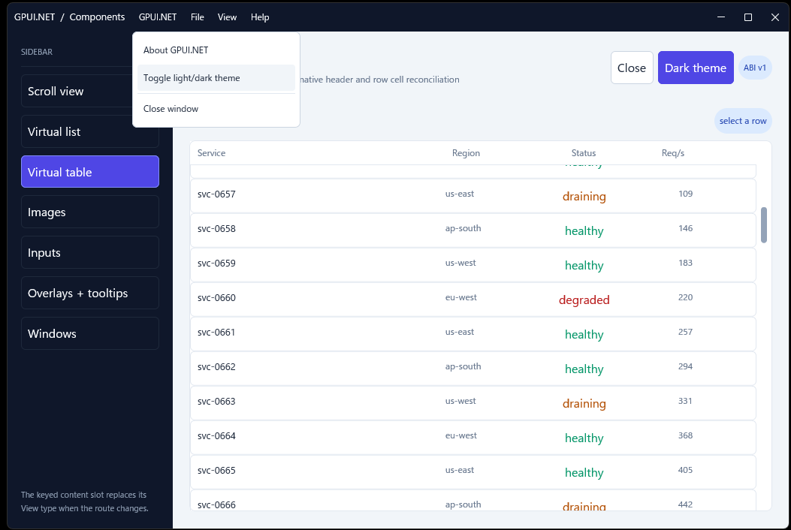

# GPUI.NET

[](https://dotnet.microsoft.com/download/dotnet/10.0)
[](https://www.nuget.org/packages/GPUI.NET/)

GPUI.NET is an experimental C# frontend for Rust [GPUI](https://gpui.rs/). Applications keep
their state and view logic in .NET; a native Rust host validates a compact render protocol and
materializes GPUI elements, windows, controls, and retained resources.

The API is semantic rather than a direct binding of every GPUI Rust type. This keeps normal C#
code platform-neutral and lets the native implementation evolve behind a versioned C ABI.

This is a preview release: public APIs, the semantic
schema, and the native ABI may change before a stable release.

## Features at a glance

### UI features

- Semantic C# layout with stacks, spacing, padding, sizing, alignment, text, buttons, inputs,
  badges, dividers, and application-owned typed styles.
- Retained `Scroll`, virtual `List`, virtual `Table`, `Input`, `Slider`, and `Dock` controls with
  native scrolling, selection, focus, IME, measurement, and pointer state.
- `Overlay`, `Dialog`, `Sheet`, `Tooltip`, `ContextMenu`, and `PopoverMenu` layers with native
  placement, viewport clamping, focus restoration, stacking, and dismissal.
- Native image decoding/caching and vector drawing with paths, fills, strokes, curves, arcs, and
  view boxes.
- Multiple windows, application menus, system or custom title bars, and native window controls.
- Build-time native extension hosts with independently versioned generated managed/native schemas;
  the optional component host provides thirty-seven catalog families and a retained Editor example.

### Platform support

| Platform | Runtime identifier | Release validation |
| --- | --- | --- |
| Windows x64 | `win-x64` | Native build plus clean consumer restore/build; Common Controls v6 manifest required by the consuming executable. |
| macOS x64 | `osx-x64` | Native build plus clean package consumer run; system title bar, traffic lights, and global menu are the default. |
| macOS ARM64 | `osx-arm64` | Native build plus clean package consumer run; managed title/menu composition can be forced. |
| Linux x64 | `linux-x64` | Native build plus clean package consumer run; install GPUI's desktop dependencies on the target distribution. |

### Hot Reload

Standard .NET Hot Reload updates compatible application-side managed code in the existing process.
Changes to `Render()`, list/table item renderers, event handlers, and style helpers rerender the
existing View tree while preserving View state, controllers, focus, scrolling, selection, and
retained resources. Rust, native code, the schema, the ABI, NativeAOT, and file assets still
require a rebuild or restart.

## Requirements

- .NET SDK/runtime 10
- the stable Rust toolchain and Cargo
- the platform prerequisites required by GPUI

The repository contains native package targets for `win-x64`, `osx-x64`, `osx-arm64`, and
`linux-x64`. Windows and macOS are the actively exercised desktop environments. macOS builds use
GPUI runtime shaders, so the Apple command-line development tools are sufficient for shader
compilation.

## Samples

The interactive sample is a component gallery covering themes, native and managed title bars,
menus, multiple windows, retained controls, virtual lists and tables, images, inputs, sliders,
overlays, and arena-growth validation.



Run it from the repository root:

```sh
dotnet run --project samples/Gpui.Sample
```

Use `--multi-window` to open a companion window or `--stress-growth` to exercise render-arena
growth. On Windows, the sample embeds
[`samples/Gpui.Sample/app.manifest`](samples/Gpui.Sample/app.manifest).

## Build and run

Clone with submodules, then build from the repository root:

```sh
git clone --recurse-submodules https://github.com/akeit0/gpui-dotnet
```

```sh
dotnet build Gpui.slnx
dotnet test Gpui.slnx --no-restore
cargo test --manifest-path crates/gpui-dotnet/Cargo.toml
dotnet run --project samples/Gpui.Sample
```

The managed build compiles the native host for the current machine and copies it beside the
managed output.

## Install from NuGet

```sh
dotnet add package GPUI.NET
```

Pin a specific preview with `dotnet add package GPUI.NET --version <version>`.

The `GPUI.NET` package brings the managed API and the platform-specific native package family.
Package consumers need the .NET 10 SDK/runtime and a desktop environment supported by the selected
runtime identifier. The standalone package page is documented in
[`NUGET_README.md`](NUGET_README.md).

## Small application

```csharp
using Gpui;
using static Gpui.Units;

var application = new GpuiApplication();
application.SetTheme(GpuiTheme.CreateDefault(GpuiThemeAppearance.Dark));
application.OpenWindow(
    MainView.Spec(),
    new GpuiWindowOptions
    {
        Title = "Hello GPUI.NET",
        Width = 900,
        Height = 600,
    }
);
application.Run();

[GpuiView]
internal sealed partial class MainView : View
{
    private readonly Signal<int> _count = new(0);

    protected override Element Render(ref RenderContext ui) =>
        ui.VStack(
                ui.Text($"Count: {_count.Value}"),
                ui.Button("increment", "Increment")
                    .OnClick(this, (view, _) =>
                    {
                        view._count.Value++;
                    })
            )
            .Gap(Px(12))
            .Padding(Px(20))
            .Grow()
            .Background(ui.Theme.Colors.Background)
            .TextColor(ui.Theme.Colors.Text);
}
```

`[GpuiView]` generates the factory used for framework-owned child views and NativeAOT. `Render()`
describes UI into a reusable managed-owned arena that grows before writes without rerunning user
rendering. Observable state changes, I/O, and task creation belong in events or accepted effects rather
than in `Render()`. Rust synchronously decodes completed output into an owned snapshot.

On Windows, the application executable must embed a Common Controls v6 manifest because the native
host uses Windows common-control APIs. Set `ApplicationManifest` in the project file and use
`samples/Gpui.Sample/app.manifest` as the reference manifest.

## Mental model

```text
C# application and View state
        │ dirty render
        ▼
flat RenderArena: nodes, operations, children, UTF-8
        │ ABI + base/extension schema negotiation
        ▼
Rust validation and retained snapshot
        │
        ├── semantic adapters ──► GPUI elements and deferred layers
        └── retained resources ─► scroll, list/table, input, slider, dock, extensions
```

Clean native repaints do not call managed `Render()`. High-frequency state such as scrolling,
selection, pointer interaction, IME composition, and slider movement stays in Rust. Managed code
is called for dirty renders, bound events, and coarse virtual-item batches.
Rust acknowledges each accepted root snapshot before managed Views mount. The first render declares
the UI; accepted effects then run with committed inputs and can command accepted resources. Commands
queued before a resource's removal cannot reach a later resource using the same key.

## Views and events

Child views are retained by slot. Use a keyed slot when a route or tab may replace the child type:

```csharp
var content = _page switch
{
    Page.Home => ui.Child("content", HomeView.Spec()),
    Page.Settings => ui.Child("content", SettingsView.Spec()),
    _ => throw new InvalidOperationException(),
};
```

Use `View<TProps>` for parent-owned inputs. Props are required on every declaration, while a stable
key retains the same child instance and its local state. `TProps` must implement
`IEquatable<TProps>`; records and record structs do so automatically:

```csharp
ui.Child("account", CounterCardView.Spec(new("Account", revision)));
```

Generated `Spec(...)` declarations enforce required props and use the same NativeAOT-safe factory
for roots and children. Construction happens on the application thread. An explicit constructor takes
`ViewConstruction` and initial props; the generator supplies it when no constructor is declared.
Props views implement `Render(in TProps props, ref RenderContext ui)`. Event-time `CommittedProps`
always means the accepted input.

Construction can initialize readonly state, controller/work handles, and owner-local memos.
`Memo<TInput, TResult>.Get` computes pure derived data in the first render and reuses equal inputs.
Read Signals before assembling the memo input. Declare external relationships with `ui.Effect`;
acceptance starts or replaces their scoped subscriptions and work. See [View lifecycle](docs/VIEW_LIFECYCLE.md).
The **Analysis** sample exercises this model as both a retained child and an independent window.

Events are bound at the element declaration and target a mounted view:

```csharp
ui.Button("save", "Save").OnClick(this, (view, _) => view.Save());
ui.Input("search"u8).OnChanged(this, (view, e) => view.Search(e));
```

Event handlers are synchronous `Action` callbacks. Use [WorkScope.Start](docs/ASYNC_WORK.md) for
asynchronous production; async-void handlers are rejected. View lifetime follows UI ownership: a
window owns its root and a committed slot owns its child; an ordinary C# reference owns neither.
Each View has one lazily allocated, stable `Lifetime` token, cancelled before terminal
owned cleanup. An unmounted instance cannot be reused. See
[View lifecycle](docs/VIEW_LIFECYCLE.md).

Managed render and lifecycle work is confined to GPUI's application thread. `Invalidate()`,
`Dispatcher.Post`, and controller commands are safe ingress points from worker threads. See
[Lifecycle and threading](docs/THREADING.md).

## Themes and application-owned variants

Every render context exposes the active application theme through `ui.Theme`. A theme can be
defined in code or loaded from direct or Zed-style JSON:

```csharp
application.SetTheme(GpuiTheme.LoadJson("theme.json"));

var card = ui.VStack(content)
    .Background(ui.Theme.Colors.SurfaceBackground)
    .TextColor(ui.Theme.Colors.Text)
    .BorderColor(ui.Theme.Colors.BorderVariant);
```

Theme changes update managed views, virtual items, and native control defaults. Theme tokens cover
semantic colors and typography. Product-specific names such as `Primary`, `Danger`, or
`Navigation` remain application-owned: implement `IGpuiElementStyle<TTag>` and apply the value
with `.Style(...)`. Use `.Surface(new(background, foreground))` for a matching base pair and
`.Paint(new InteractionColors(normal, hover, pressed))` for complete native interaction pairs.
Both compose existing fluent operations and preserve ordinary text inheritance. Secondary child
colors remain explicit in component recipes; see [Styling](docs/STYLING.md) for precedence,
component boundaries, and the upstream limitation on contextual roles.

## Windows, title bars, and menus

One `GpuiApplication` owns one native event loop and any number of independent windows. Each
window has its own root view tree, retained resources, render snapshots, and failure boundary.

```csharp
var window = application.OpenWindow(
    DocumentView.Spec(),
    new GpuiWindowOptions
    {
        Title = "Document",
        TitleBarStyle = WindowTitleBarStyle.System,
    }
);

// Later, after the native window opens:
window.SetTitle("Renamed document");
window.Resize(1000, 720);
window.Activate();
```

Window commands such as `ToggleFullscreen()` and `ToggleMaximize()` act on an already-open
native window.

`window.ShowToast(new GpuiToast("save", "File saved"))` posts a window notification. Posting the
same ID replaces it; `DismissToast(id)` and `ClearToasts()` close notifications without changing
the managed View snapshot. The [sample](samples/Gpui.Sample/README.md) has interactive controls.

`WindowTitleBarStyle` supports `System`, `Custom`, and `Hidden`. Custom title bars use semantic
`WindowControlArea` regions for native drag, minimize, maximize, and close behavior.
Set `GpuiWindowOptions.InitialState` to `Maximized` or `Fullscreen` to open in that native state;
`Width`, `Height`, `Left`, and `Top` remain the restore bounds.
Set `MinimumWidth` and `MinimumHeight` together to request a native minimum window size.
After a window closes, `GpuiWindow.FinalPlacement` supplies its last normal bounds and final
native state for application-owned persistence. A failed open leaves this value null.
`GpuiWindow.Opened` and `Closed` and the corresponding `GpuiApplication.WindowOpened` and
`WindowClosed` events report native window creation and post-teardown closure on the application
thread. Window events run before their application-wide counterparts. A pending window canceled
before native creation emits neither event.
`GpuiApplication.Ready` runs after native initialization and initial window creation;
`Stopped` runs after `Run()` has finished native and managed cleanup, including failure paths.
`Ready` uses the GPUI thread; `Stopped` uses the Run execution thread, or the caller if launching
that thread fails. `IsReady` reflects the active interval.

Declare application commands once with `GpuiMenu[]`. macOS installs them in the global native menu
bar. `GpuiTitleBar.RenderWindow` uses the same definitions for a minimal managed menu/title bar on
Windows and Linux; macOS keeps its system title bar unless `forceManagedMenuOnMac` is requested.
The helper is optional—applications may compose `PopoverMenu`, buttons, and control regions
manually.

## Retained controls and data

The following components keep interaction state in Rust across managed renders:

- `Scroll`: offset, wheel/trackpad motion, and overlay scrollbar
- `List`: viewport, measurements, keyboard navigation, and batched item cache
- `Table`: the list collection engine plus declarative native column/header layout
- `Input`: value, selection, focus, clipboard, IME, caret, and horizontal reveal
- `Slider`: value/range, pointer drag, keyboard interaction, and release events
- `Dock`: tab groups, nested splits, panel focus, drag/drop, and splitter geometry

Controllers provide imperative operations without moving ownership back to C#. For example,
`ScrollController.ScrollToTop`, `ListController.ScrollToItem`, `InputController.Focus`, and
`SliderController.SetValue` enqueue native resource commands.

Dock uses a structural managed declaration and retained native interaction. `DockPanel` content can
be an ordinary element tree or a keyed child View; normal managed rerenders update content without
resetting native tab moves, splitter sizes, or side-region state. Dock supports center tabs, horizontal and vertical splits, and declarative side regions with
native collapse and resizing. Controllers support close, region visibility, and layout import/export;
layout and close events report native changes. See [Retained Dock](docs/CONTROLS.md#retained-dock).

Virtual items are generated in aligned batches:

```csharp
[GpuiListItem]
private Element Item(int index, ref RenderContext ui) =>
    ui.Button("item", $"Item {index:N0}")
        .OnClick(this, (view, e) => view.OpenItem(e), checked((ulong)index));

protected override Element Render(ref RenderContext ui) =>
    ui.List(
            ref _list,
            new ListDataSource(_items.Count, _contentRevision),
            Items.Item
        )
        .Grow();
```

Increment `contentRevision` whenever cached item output can change. Items are element-only snapshots,
not mounted child views, and cannot contain nested retained resources or deferred layers.

## Images, vector drawings, and overlays

`ui.Image` sends a filesystem path and presentation options to GPUI's native decoder/cache.
Supported fits are `Fill`, `Contain`, `Cover`, `ScaleDown`, and `None`.

`ui.Drawing` layers native vector paths inside normal GPUI layout. A `ViewBox` maps stable drawing
coordinates into the final element bounds, while stroke widths remain device-independent pixels:

```csharp
var area = ui.Path()
    .MoveTo(0, 100)
    .LineTo(50, 35)
    .LineTo(100, 60)
    .LineTo(100, 100)
    .Close()
    .Fill(ui.Theme.Colors.Accent.WithAlpha(40));

var line = ui.Path()
    .MoveTo(0, 100)
    .LineTo(50, 35)
    .LineTo(100, 60)
    .Stroke(ui.Theme.Colors.Accent, Px(2));

return ui.Drawing(area, line).ViewBox(0, 0, 100, 100).Height(Px(240));
```

Paths support lines, quadratic and cubic Bézier curves, elliptical arcs, fill rules, strokes, and
dash patterns. `Rect`, `Ellipse`, `Circle`, and `Line` are convenience path factories. `Circle`
keeps a uniform rendered radius when a ViewBox scales its axes independently; `Ellipse` follows
the independent axis scales.

For app-defined animation, `ui.Dynamic(active, child)` transparently requests one managed render
per display frame while `active` remains true. Compute progress from a monotonic clock and rebuild
the target subtree normally; invalidations are synchronized to GPUI frames and deduplicated per
owning View:

```csharp
var progress = Math.Clamp(Stopwatch.GetElapsedTime(_started).TotalSeconds / 0.4, 0, 1);
return ui.Dynamic(progress < 1, RenderChart(ref ui, (float)progress));
```

Window-relative composition includes:

- `Overlay` for generic modal or non-modal layers
- `Dialog` and `Sheet` as overlay compositions
- `Tooltip` for delayed, trigger-relative content
- `ContextMenu` for pointer-anchored right-click content
- `PopoverMenu` for trigger-attached left-click menus

Rust owns placement, viewport clamping, focus restoration, stacking, and dismissal. Layer content
and actions remain normal managed elements and callbacks.

## Hot Reload in development

Run the standard .NET watcher for an application project:

```sh
dotnet watch --project path/to/App.csproj
```

The metadata-update handler invalidates managed View fragments and native List/Table item snapshots,
then requests a new frame. Compatible method-body edits are applied to existing View instances:

| Edit | Result |
| --- | --- |
| `Render()`, item renderers, event handlers, or style helpers | Existing UI rerenders without recreating the application. |
| Text, colors, spacing, layout, or compatible event bindings | Updated output or behavior with state preserved. |
| Rust, native bindings, schema, ABI, NativeAOT, JSON, or file assets | Rebuild or restart required. |

Constructors are not rerun. Derived memos clear and declared effects restart after acceptance. Unsupported CLR edits are handed
back to `dotnet watch`, which restarts the application when required.

## Repository layout

```text
bindings/                 base schema and optional-extension registry
crates/gpui-dotnet/       Rust native host
src/Gpui/                 application-facing meta package and build assets
src/Gpui.Core/            platform-neutral managed API, runtime, and package project
src/Gpui.Editor/          optional editor schema assembly
src/Gpui.Components/      optional gpui-component catalog schema assembly
src/Gpui.Native/          RID-specific native package projects
src/Gpui.Generators/      Roslyn generators for views and list items
samples/Gpui.Sample/      interactive component gallery
samples/Gpui.Components.Sample/ optional native component-catalog sample
tests/Gpui.Tests/         managed contract and generator tests
tools/                    base/extension binding generator and UI driver
eng/                      native build, staging, and packaging scripts
docs/                     design and contributor documentation
```

## Development checks

Run these before submitting changes:

```sh
dotnet tool restore
dotnet csharpier format .
dotnet csharpier check .
dotnet run --project tools/Gpui.Bindings.Generator -- verify
cargo fmt --manifest-path crates/gpui-dotnet/Cargo.toml -- --check
cargo test --manifest-path crates/gpui-dotnet/Cargo.toml
dotnet test Gpui.slnx --no-restore
dotnet build samples/Gpui.Sample/Gpui.Sample.csproj --no-restore
```

Ordinary tests exclude timing probes. Run `./eng/measure-runtime.ps1` in PowerShell for the
separate Release measurements; see [Performance](docs/PERFORMANCE.md#running-timing-probes).

When the base schema or a schema registered by `bindings/extensions.json` changes, regenerate the
managed and Rust bindings:

```sh
dotnet run --project tools/Gpui.Bindings.Generator -- generate
dotnet run --project tools/Gpui.Bindings.Generator -- verify
```

Do not edit generated semantic or extension schema files by hand.

## Documentation

Use the [documentation index](docs/README.md) to find application guides and implementation references.
Start with [Components](docs/COMPONENTS.md) for authoring, [Contributing](docs/CONTRIBUTING.md)
for formatting and checks, or [Architecture](docs/ARCHITECTURE.md) for ownership boundaries.
The [generated ID catalog](docs/SEMANTIC_IDS.md) lists the current semantic protocol.

GPUI.NET uses the pinned `gpui-base` foundation recorded in
[the native upstream baseline](docs/UPSTREAM_BASELINE.md) while retaining its own semantic ABI and
managed/native runtime. See [NOTICE](NOTICE) for attribution.
